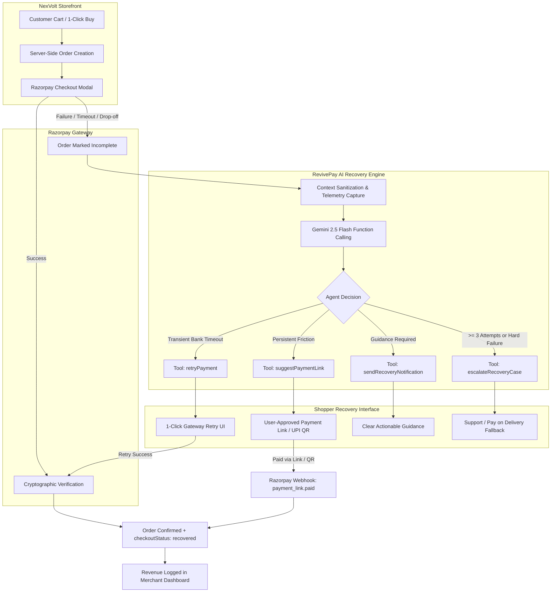

<div align="center">

# ⚡ NexVolt & RevivePay

### *Autonomous AI-Powered Revenue Recovery & Electronics E-Commerce Platform*
**Razorpay Buildathon — Track 03: AI Revenue Recovery**

[](https://razorpay.com/)
[](https://aistudio.google.com/)
[](https://react.dev/)
[](https://nodejs.org/)
[](https://www.mongodb.com/)

<p align="center">
  <b>NexVolt</b> is a high-performance modern electronics e-commerce platform.<br>
  <b>RevivePay</b> is an autonomous AI agent operating inside NexVolt that detects payment failures and cart drop-offs, predicts the optimal recovery route using Gemini function calling, and recovers lost revenue at 100% full order value without price discounts.
</p>

---

</div>

## 📌 Table of Contents
- [Executive Overview](#-executive-overview)
- [System Architecture](#-system-architecture)
- [How RevivePay Works](#-how-revivepay-works)
- [RevivePay AI Agent & Gemini Tooling](#-revivepay-ai-agent--gemini-tooling)
- [Strict Guardrails & Safety Architecture](#-strict-guardrails--safety-architecture)
- [Razorpay Security & Signature Verification](#-razorpay-security--signature-verification)
- [Merchant AI Recovery Hub](#-merchant-ai-recovery-hub)
- [Tech Stack](#-tech-stack)
- [Getting Started](#-getting-started)
- [Environment Configuration](#-environment-configuration)
- [How to Test in Razorpay Test Mode](#-how-to-test-in-razorpay-test-mode)
- [API Reference](#-api-reference)

---

## 🚀 Executive Overview

When a customer attempts to purchase high-value electronics (e.g. ₹50,000 laptops, audio gear, accessories), checkout friction, OTP delays, and bank timeouts cause high cart abandonment.

Traditional platforms either display a generic failure error or erode merchant profit margins through automated discount codes.

**RevivePay changes the paradigm:**
- **Zero Discounts**: Recovers revenue without altering order prices, protecting merchant margins.
- **Autonomous Diagnostics**: Leverages **Google Gemini 2.5 Flash** with function calling to diagnose why the transaction failed and trigger the single safest, most effective recovery route.
- **User-Approved Razorpay Payment Links**: If gateway drops persist, RevivePay asks the shopper and generates direct Razorpay payment links / UPI QR codes on demand.
- **Live Merchant Telemetry**: Real-time tracking of *Revenue at Risk*, *Revenue Recovered*, *Recovery Rate %*, and an interactive *Agent Activity Timeline*.

---

## 🏛 System Architecture



---

## 🧠 How RevivePay Works

1. **Failure Telemetry Capture**:
   When a payment fails or times out (configured to 60s for evaluation), `POST /api/orders/:orderId/fail` captures diagnostic metadata (error code, reason, step, payment ID, timestamp).
2. **Contextual AI Assessment**:
   RevivePay compiles a sanitized payload (order total, item categories, failure codes, and prior attempt counts) and submits it to Gemini.
3. **Controlled Tool Execution**:
   Gemini invokes one of four strictly defined function tools. The Express backend validates parameters and updates `order.revivePayCase`.
4. **Targeted Customer Resolution**:
   - **1-Click Retry**: If the error was transient, RevivePay provides polite guidance and a direct retry trigger.
   - **Payment Link Generation**: If requested, RevivePay calls the Razorpay API to generate a direct payment link (`https://rzp.io/rzp/...`) that can be completed on mobile UPI.
5. **Instant Confirmation**:
   While the link is open, the frontend listens via live webhook / polling. Once paid, the order immediately transitions to the confirmed celebration state.

---

## 🛠 RevivePay AI Agent & Gemini Tooling

RevivePay uses the official `@google/genai` Node.js SDK and `gemini-2.5-flash` with controlled function declarations:

| Tool Name | Trigger Condition | Customer Action |
|:---|:---|:---|
| `retryPayment` | Temporary bank gateway timeouts, OTP delays, network drops | Provides reassurance and 1-click Razorpay retry |
| `suggestPaymentLink` | Modal rendering issues, mobile interruptions, or repeat drops | Asks user, then generates Razorpay Link / UPI QR |
| `sendRecoveryNotification` | Specific card verification or account limits | Dispatches clear, polite non-technical instructions |
| `escalateRecoveryCase` | Maximum attempts (3) reached or irreversible rejection | Dispatches support options & Pay on Delivery |

---

## 🛡 Strict Guardrails & Safety Architecture

- 🚫 **No Discounts Rule**: Zero coupon creation, margin reduction, or price modification logic. All recovery occurs at 100% full order value.
- 🔒 **Already-Paid Guard**: Orders with `paymentStatus === 'paid'` are immutable and automatically reject any recovery triggers.
- ⏱ **Attempt Throttling**: Hard cap of **3 recovery interventions per order**. If not resolved within 3 attempts, the case escalates safely.
- 🤝 **User-Approved Links**: The AI never generates external payment links unprompted. It asks the customer, and only generates when the user clicks `"Create Payment Link"`.
- ⚡ **Zero-Disruption Fallback**: If network latency or API unavailability occurs, a deterministic safety engine immediately resolves the case.

---

## 🔐 Razorpay Security & Signature Verification

- **Server-Side Order Creation**: Orders are created using the official `razorpay` Node SDK on the Express server (`POST /api/orders/initiate`), returning server-authorized `razorpayOrderId`s.
- **Cryptographic HMAC-SHA256 Verification**:
  $$\text{Generated Signature} = \text{HMAC-SHA256}(\text{order\_id} + "|" + \text{payment\_id}, \text{RAZORPAY\_KEY\_SECRET})$$
  Only when cryptographic verification passes is an order marked `paid`.
- **Webhook Handlers**: Listeners on `POST /api/webhooks/razorpay` for `order.paid`, `payment.failed`, and `payment_link.paid`.

---

## 📊 Merchant AI Recovery Hub

Merchants have full visibility into the AI's operations via **Tab 3** of the Merchant Dashboard:
- 🔴 **Revenue at Risk**: Total value of unpaid drop-offs and failed checkouts.
- 🟢 **Revenue Recovered**: Total value recovered through RevivePay interventions.
- 🔵 **Recovery Success Rate %**: Real-time conversion efficiency.
- 🟣 **Active Cases**: Transactions currently under RevivePay monitoring.
- 📜 **Agent Activity Timeline**: Chronological event feed showing every AI diagnosis and recovery milestone.

---

## 💻 Tech Stack

### Frontend
- **React 19 & TypeScript**: Component architecture & strict typing
- **Vite 8**: Next-generation lightning frontend build tool
- **TailwindCSS**: Premium responsive design system
- **Lucide Icons & Canvas Confetti**: Rich visual feedback
- **Clerk Authentication**: Secure consumer & merchant identity

### Backend
- **Node.js & Express**: High-performance RESTful API
- **MongoDB & Mongoose**: Order state management & decision logs
- **@google/genai SDK**: Gemini 2.5 Flash function calling agent
- **Razorpay Node.js SDK**: Order creation, payment links, and signature verification
- **Cloudinary**: Product image hosting & media storage

---

## 📦 Getting Started

### Prerequisites
- **Node.js** (v18+ recommended)
- **Yarn** or **npm**
- **MongoDB** (Local or MongoDB Atlas cluster)
- **Razorpay Test Account** ([dashboard.razorpay.com](https://dashboard.razorpay.com))
- **Google Gemini API Key** ([aistudio.google.com](https://aistudio.google.com))
- **Clerk Account** ([dashboard.clerk.com](https://dashboard.clerk.com))

---

## ⚙️ Environment Configuration

### 1. Backend (`server/.env`)
Create a `.env` file in the `server/` directory:

```env
PORT=5000
MONGODB_URI=your_mongodb_connection_string
FRONTEND_URL=http://localhost:5173

# Clerk Auth Secret Key
CLERK_PUBLISHABLE_KEY=pk_test_your_clerk_publishable_key
CLERK_SECRET_KEY=sk_test_your_clerk_secret_key

# Razorpay Credentials (Test Mode)
RAZORPAY_KEY_ID=rzp_test_your_razorpay_key_id
RAZORPAY_KEY_SECRET=your_razorpay_key_secret
RAZORPAY_WEBHOOK_SECRET=your_optional_webhook_secret

# Cloudinary
CLOUDINARY_CLOUD_NAME=your_cloudinary_name
CLOUDINARY_API_KEY=your_cloudinary_key
CLOUDINARY_API_SECRET=your_cloudinary_secret

# Google Gemini API Key
GEMINI_API_KEY=your_gemini_api_key
```

### 2. Frontend (`client/.env`)
Create a `.env` file in the `client/` directory:

```env
VITE_CLERK_PUBLISHABLE_KEY=pk_test_your_clerk_publishable_key
VITE_CLERK_SIGN_IN_URL=/sign-in
VITE_CLERK_SIGN_UP_URL=/sign-up

VITE_API_URL=http://localhost:5000/api
VITE_RAZORPAY_KEY_ID=rzp_test_your_razorpay_key_id
```

---

## 🏃 Running the Application

### 1. Install Dependencies
```bash
# In the server directory
cd server
yarn install

# In the client directory
cd ../client
yarn install
```

### 2. Start Servers
```bash
# Terminal 1: Backend Server (runs on http://localhost:5000)
cd server
yarn dev

# Terminal 2: Frontend Client (runs on http://localhost:5173)
cd client
yarn dev
```

---

## 🧪 How to Test in Razorpay Test Mode

1. **Test 1-Click Recovery**:
   - Add any electronics item to cart and proceed to checkout.
   - Select **Razorpay** and click **Place Order**.
   - In the Razorpay modal, select **Failure** or let the 60s timer expire.
   - RevivePay diagnoses the failure and presents a clean **Retry Payment** action.
   - Click **Retry Payment**, select **Success** in Test Mode, and watch the order confirm with confetti.
2. **Test User-Approved Payment Link**:
   - On a failed checkout, if RevivePay suggests a payment link, click **Create Payment Link**.
   - Open the generated Razorpay URL (`https://rzp.io/rzp/...`) in a new tab and pay.
   - The original checkout tab automatically confirms the order upon webhook / poll notification.
3. **Verify Merchant Dashboard**:
   - Visit `/merchant/dashboard?tab=recovery`.
   - Inspect the **Revenue Recovered** metric and the chronological **Agent Activity Timeline**.

---

## 📡 API Reference

| Method | Endpoint | Description |
|:---|:---|:---|
| `POST` | `/api/orders/initiate` | Creates a server-side order and Razorpay order ID |
| `POST` | `/api/orders/:orderId/verify-payment` | Verifies cryptographic HMAC-SHA256 signature |
| `POST` | `/api/orders/:orderId/fail` | Captures diagnostic failure telemetry |
| `POST` | `/api/recovery/analyze/:orderId` | Triggers RevivePay AI evaluation with Gemini |
| `POST` | `/api/recovery/generate-link/:orderId` | Generates customer-approved Razorpay Payment Link |
| `GET` | `/api/recovery/analytics` | Returns aggregated metrics & timeline feed |
| `POST` | `/api/webhooks/razorpay` | Listens to Razorpay payment & link events |

---

## 📄 License
This project is built for the **Razorpay Buildathon 2026**.
All rights reserved © 2026 NexVolt & RevivePay Team.