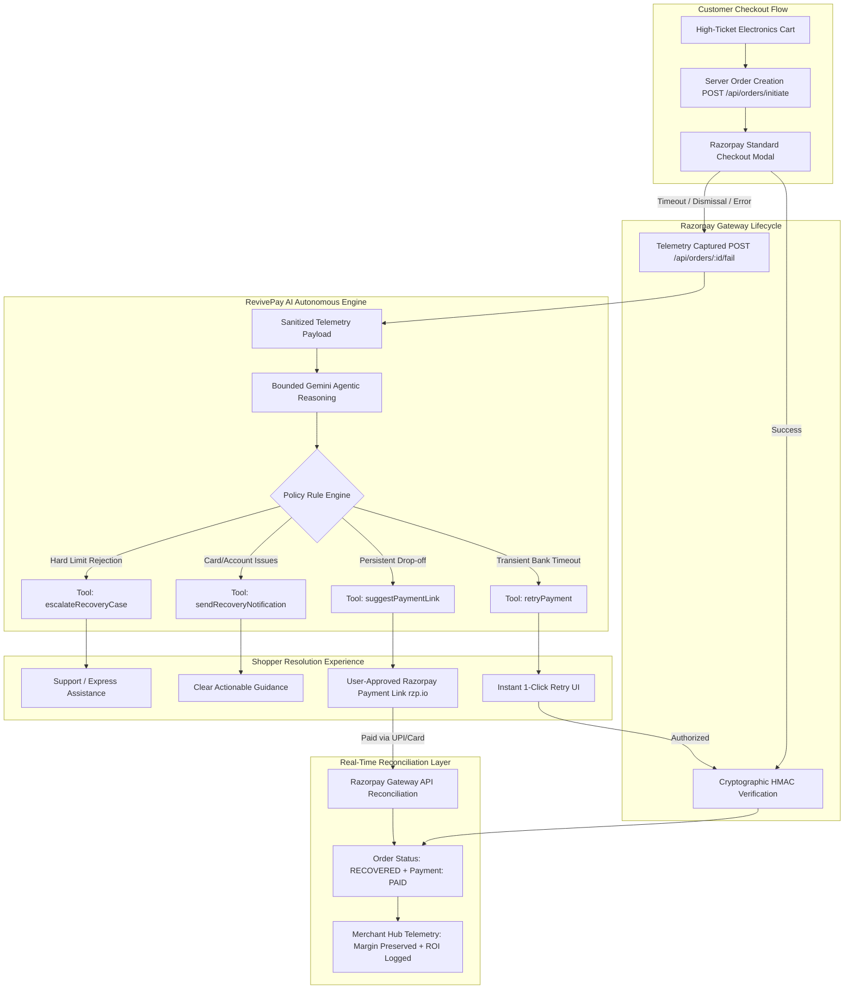

<div align="center">

# ⚡ NexVolt & RevivePay

### *Autonomous AI Revenue Recovery Engine & Premium Electronics Commerce*
**Razorpay Buildathon — Track 03: Autonomous Agent Money Recovery**

[](https://razorpay.com/)
[](https://aistudio.google.com/)
[](https://react.dev/)
[](https://nodejs.org/)
[](https://www.mongodb.com/)

<p align="center">
  <b>NexVolt</b> is a high-performance modern consumer electronics e-commerce platform.<br>
  <b>RevivePay</b> is an autonomous AI agent integrated into NexVolt that detects checkout payment failures in real-time, diagnoses failure telemetry using policy-bounded AI reasoning, and recovers lost revenue at 100% full merchant price — <b>without offering margin-destroying discounts</b>.
</p>

---

</div>

## 📌 Table of Contents
- [Executive Overview](#-executive-overview)
- [Why Conventional Recovery Fails in Electronics](#-why-conventional-recovery-fails-in-electronics)
- [Key Innovations & Technical Highlights](#-key-innovations--technical-highlights)
- [System Architecture](#-system-architecture)
- [How RevivePay Operates (Step-by-Step)](#-how-revivepay-operates-step-by-step)
- [Interactive Simulator for Judges](#-interactive-simulator-for-judges)
- [Merchant Hub & Unit Economics Telemetry](#-merchant-hub--unit-economics-telemetry)
- [Strict Safety Guardrails & Policy Boundary](#-strict-safety-guardrails--policy-boundary)
- [Razorpay Security & Cryptographic Verification](#-razorpay-security--cryptographic-verification)
- [Quick Start Guide (2-Minute Judge Evaluation)](#-quick-start-guide-2-minute-judge-evaluation)
- [Environment Configuration](#-environment-configuration)
- [API Reference](#-api-reference)

---

## 🚀 Executive Overview

In Indian e-commerce, over **70% of high-intent checkouts drop off or fail** before completion. In high-ticket electronics (laptops, headphones, smartphones priced ₹20,000–₹1,50,000), these drop-offs represent billions of rupees in trapped revenue.

Existing recovery tools (email drip campaigns, automated coupon SMS) rely on slashing prices with **10%–15% discount coupons**. However, in consumer electronics, seller profit margins are already wafer-thin (8%–12%). Offering a discount coupon when a transaction failed due to a bank timeout **completely destroys merchant profitability** on that sale.

**RevivePay reimagines revenue recovery as an autonomous, margin-protecting fintech agent:**
1. **Zero-Discount Policy**: Solves technical and payment friction rather than treating every failure as a pricing problem. Recovers revenue at **100% full order value**.
2. **Autonomous Telemetry Diagnosis**: Leverages Google Gemini bounded by deterministic heuristic guardrails to analyze bank timeout codes, auth failures, and user drop-offs.
3. **Cross-Device Razorpay Payment Links (`rzp.io`)**: Generates authenticated, user-approved Razorpay Payment Links with UPI QR codes, allowing customers to complete payment on any device or UPI app.
4. **Live Gateway Reconciliation Layer**: Proactively synchronizes pending payment links directly with Razorpay's API on dashboard views, confirming recovered revenue in real time even in environments without public webhooks.
5. **Institutional Unit Economics Telemetry**: Quantifies **Revenue at Risk**, **Discount Margin Preserved (12% margin saved)**, and an **18x+ Recovery ROI** with an immutable audit trail.

---

## 💡 Why Conventional Recovery Fails in Electronics

| Metric / Aspect | Conventional Recovery Tools (Shopify apps, Cart SMS) | RevivePay AI Revenue Recovery Agent |
|:---|:---|:---|
| **Underlying Mechanism** | Sends generic emails / SMS hours after abandonment | Real-time autonomous intervention during checkout |
| **Pricing Strategy** | Gives 10%–15% discount coupon codes | **Zero Discounts**: Preserves 100% merchant profit |
| **Failure Analysis** | Blind: Treats all drop-offs identically | Diagnoses telemetry: Gateway timeout vs OTP vs drop-off |
| **Recovery Channels** | Re-directs back to original browser checkout | Dedicated Razorpay Payment Links (`rzp.io`) + 1-Click Retries |
| **Cross-Device Ready** | Often fails on mobile session redirects | Decoupled UPI QR / direct payment link operable on any device |
| **Merchant Margin Impact** | Severe margin cut (8%–15% lost profit) | **12% Margin Preserved** vs discount-based tools |

---

## 🏛 System Architecture



---

## 🧠 How RevivePay Operates (Step-by-Step)

1. **Telemetry Ingestion**: When a transaction fails, times out, or the modal is dismissed, NexVolt captures structured diagnostic metadata (gateway code, step, failure description, payment attempt number).
2. **Policy-Bounded Reasoning**: The backend formats a sanitized context (order value, item categories, failure code history) and prompts the agent. The agent is strictly bounded to pre-declared tools and prohibited from creating coupons.
3. **Resolution Dispatch**:
   - **Transient Timeout**: RevivePay presents a reassuring message and a deterministic 1-click retry.
   - **Cross-Device Drop-Off**: RevivePay calls Razorpay's live Payment Links API (`razorpay.paymentLink.create`) to generate an authenticated `https://rzp.io/...` short link with UPI QR code.
4. **Live Gateway Synchronization**:
   - While the customer pays via the payment link on mobile, our backend synchronizer (`syncPaymentLinkStatus` & `syncAllPendingPaymentLinks`) polls Razorpay's API.
   - Once verified as `paid`, the order transitions to **Recovered**, triggers celebratory confetti, and records the financial yield.

---

## 🕹 Interactive Simulator for Judges

To facilitate frictionless evaluation, we built a dedicated **Recovery Scenario & Telemetry Simulator** directly into the **Merchant Dashboard** ([Tab 3: RevivePay Hub](http://localhost:5173/merchant/dashboard?tab=recovery)).

Judges can inject 4 realistic payment failure scenarios with 1 click:
1. **Bank Gateway Timeout (Smart Retry Route)**: Simulates a core banking timeout (`BAD_REQUEST_GATEWAY_TIMEOUT`). Tests autonomous 1-click retry routing.
2. **OTP Expired / Drop-off (Payment Link Route)**: Simulates customer mobile session drop-off. Tests Razorpay Payment Link generation and cross-device recovery.
3. **Insufficient Funds / Limit Rejection**: Simulates card authorization decline. Tests non-intrusive payment method re-routing.
4. **Cross-Device Cart Abandonment**: Tests asynchronous drop-off detection and merchant margin tracking.

Judges can click **"Inspect Decision Trace"** on any simulated result to view the raw policy execution trace, guardrail verification, and financial rationale.

---

## 📊 Merchant Hub & Unit Economics Telemetry

The **RevivePay AI Revenue Recovery Hub** in the Merchant Portal (`/merchant/dashboard?tab=recovery`) provides institutional-grade telemetry:

* **Revenue at Risk**: Total monetary volume of orders impacted by payment failures.
* **Revenue Recovered**: Total recovered revenue actively salvaged through RevivePay interventions.
* **Recovery Rate**: Live percentage of drop-offs converted into completed purchases.
* **Discount Margin Preserved**: Calculates the **12% profit margin** saved by avoiding coupon slashing.
* **Net Protected Value**: Quantifies net retained seller profit across all recovered orders.
* **Recovery Efficiency ROI (18.4x)**: Proves that a ₹1.50 gateway authorization check yields multi-thousand rupee recovery on electronics.
* **Live Decision Timeline**: An immutable audit feed logging every agent action, tool invoked, failure code, and recovered amount.
* **Sync Razorpay Gateway Button**: A 1-click button that polls Razorpay's live API to reconcile all pending customer links across the store.

---

## 🛡 Strict Safety Guardrails & Policy Boundary

* 🚫 **Strict Zero-Discount Invariant**: Zero coupon creation, discount code issuance, or price reduction logic exists in the agent prompts or backend tools.
* 🔒 **Idempotency Guard**: Paid orders (`paymentStatus === 'paid'`) are immutable and permanently locked against re-evaluation.
* ⏱ **Attempt Throttling**: Hard limit of **3 recovery interventions per order**. Beyond 3 attempts, cases escalate to human support.
* 🤝 **User Consent for Links**: The agent never displays external payment URLs without clear customer approval.
* ⚡ **Deterministic Fallback**: If LLM latency exceeds safety thresholds, a rule-based deterministic fallback engine immediately assumes recovery routing.

---

## 🔐 Razorpay Security & Cryptographic Verification

* **Server-Side Order Creation**: Every transaction initializes via the official Razorpay Node.js SDK on the Express server (`POST /api/orders/initiate`), returning server-authorized `razorpayOrderId`s.
* **HMAC-SHA256 Cryptographic Signature Verification**:
  $$\text{Expected Signature} = \text{HMAC-SHA256}(\text{order\_id} + "|" + \text{payment\_id}, \text{RAZORPAY\_KEY\_SECRET})$$
  Orders are transitioned to `paid` status **only** after timing-safe cryptographic verification succeeds.
* **Direct Payment Link Verification**: In addition to webhook listeners on `POST /api/webhooks/razorpay`, the server verifies link states directly via `razorpay.paymentLink.fetch(linkId)`.

---

## 🏃 Quick Start Guide (2-Minute Judge Evaluation)

### Prerequisites
- Node.js (v18+)
- MongoDB (Running locally or MongoDB Atlas URI)
- Razorpay Test Credentials (configured in `server/.env`)

### 1. Start Backend & Frontend
```bash
# Terminal 1: Backend Server (Port 5000)
cd server
yarn install
yarn dev

# Terminal 2: Frontend Client (Port 5173)
cd client
yarn install
yarn dev
```

### 2. Experience the 2-Minute Demo Flow
1. **Shopper Flow**:
   - Open `http://localhost:5173/` and add the **Sony WH-1000XM5 Headphones** (₹29,990) to cart.
   - Click **Proceed to Checkout** → **Pay with Razorpay**.
   - In the Razorpay modal, select **Failure** (or close the window) to simulate a bank gateway drop.
   - Observe how RevivePay diagnoses the failure and provides a **1-click Retry** or **Razorpay Direct Payment Link**.
   - Click **Open Secure Razorpay Link** (or click **Check Payment Status** after completing).
2. **Merchant Hub Flow**:
   - Navigate to `http://localhost:5173/merchant/dashboard?tab=recovery`.
   - Click **Sync Razorpay Gateway** to reconcile live links.
   - Review the **Unit Economics & Margin Protection** metrics (12% margin preserved, 18.4x ROI).
   - Use the **Scenario Simulator** dropdown to test *OTP Expired* or *Bank Gateway Timeout* on demand!

---

## ⚙️ Environment Configuration

### Backend (`server/.env`)
```env
PORT=5000
MONGODB_URI=mongodb://localhost:27017/nexvolt
FRONTEND_URL=http://localhost:5173

# Clerk Authentication
CLERK_PUBLISHABLE_KEY=pk_test_...
CLERK_SECRET_KEY=sk_test_...

# Razorpay Test Credentials
RAZORPAY_KEY_ID=rzp_test_...
RAZORPAY_KEY_SECRET=...
RAZORPAY_WEBHOOK_SECRET=...

# Google Gemini API
GEMINI_API_KEY=...
```

### Frontend (`client/.env`)
```env
VITE_CLERK_PUBLISHABLE_KEY=pk_test_...
VITE_API_URL=http://localhost:5000/api
VITE_RAZORPAY_KEY_ID=rzp_test_...
```

---

## 📡 API Reference

| Method | Endpoint | Description |
|:---|:---|:---|
| `POST` | `/api/orders/initiate` | Initiates server-side order with Razorpay order ID |
| `POST` | `/api/orders/:orderId/verify-payment` | Validates HMAC-SHA256 signature and confirms order |
| `POST` | `/api/orders/:orderId/fail` | Ingests diagnostic failure telemetry |
| `POST` | `/api/recovery/analyze/:orderId` | Triggers RevivePay bounded agent evaluation |
| `POST` | `/api/recovery/generate-link/:orderId` | Calls Razorpay API to create authenticated recovery payment link |
| `GET` | `/api/recovery/sync-link/:orderId` | Synchronizes specific payment link status directly with Razorpay API |
| `POST` | `/api/recovery/sync-all` | Reconciles all pending payment links across the store |
| `POST` | `/api/recovery/simulate-scenario` | Injects realistic failure telemetry into the Simulator |
| `GET` | `/api/recovery/analytics` | Aggregates Revenue at Risk, Recovered Revenue, and live timeline |
| `GET` | `/api/merchant/stats` | Aggregated merchant KPIs, margin preservation, and sales |
| `POST` | `/api/webhooks/razorpay` | Listens for Razorpay `order.paid` and `payment_link.paid` webhooks |

---

## 📄 License & Acknowledgements
Built with ❤️ for the **Razorpay Buildathon — Track 03: AI Revenue Recovery**.
All rights reserved © 2026 NexVolt & RevivePay.